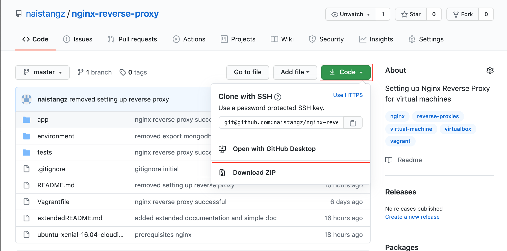

# Nginx Reverse Proxy App

> - **For the extended documentation, click** [here](extendedREADME.md)
> - **To read more about Vagrant and Virtual Machines, click** [here](https://github.com/naistangz/Technical_Training/tree/master/docs/Week7_VM)


## Introduction
Nginx is a popular open-source web server. It can be useful to run on a virtual machine when hosting multiple websites. The general solution for running two web servers on a single system is to either use multiple IP addresses or different port numbers.
This project demonstrates how to configure Nginx as a reverse proxy. 

**To get started download the zip file or** `git clone` this repository onto your local machine

**Option 1**
 

**Option 2**
Open up **Terminal** and enter the following 
```bash
git clone https://github.com/naistangz/nginx-reverse-proxy.git
```


## Prerequisites
You will need the following:

1. [Vagrant](https://www.vagrantup.com/downloads.html)
2. [Virtual Box](https://www.virtualbox.org/wiki/Downloads)
3. [Ruby - Preinstalled in Mac](https://www.ruby-lang.org/en/downloads/)
4. [Bundler](https://bundler.io/) or `gem install bundler` in **Terminal** after **Ruby** has been installed.


## Checking versions for dependencies
```bash
Anaiss-MacBook-Pro:nginx-reverse-proxy anaistang$ vagrant --version
Vagrant 2.2.9
```

```bash
Anaiss-MacBook-Pro:nginx-reverse-proxy anaistang$ ruby --version
ruby 2.3.7p456 (2018-03-28 revision 63024) [universal.x86_64-darwin18]
```

```bash
Anaiss-MacBook-Pro:nginx-reverse-proxy anaistang$ bundle --version
Bundler version 2.1.4
```

## Running Vagrant 
1.  Change directory (cd) into the project 
`Anaiss-MacBook-Pro: cd nginx-reverse-proxy`

2. Run vagrant in the `nginx-reverse-proxy` folder 
```bash
$ vagrant up 
```
This will create, configure and provision two virtual machines, the `app` and `db` machine according to the Vagrantfile.

3. Accessing the shell with Vagrant SSH
```bash
$ vagrant ssh app
```
This will SSH into a running Vagrant machine and give you access to the `app` virtual machine.

**which returns**

```bash
Welcome to Ubuntu 16.04.6 LTS (GNU/Linux 4.4.0-186-generic x86_64)

 * Documentation:  https://help.ubuntu.com
 * Management:     https://landscape.canonical.com
 * Support:        https://ubuntu.com/advantage


0 packages can be updated.
0 updates are security updates.

New release '18.04.4 LTS' available.
Run 'do-release-upgrade' to upgrade to it.


Last login: Wed Aug  5 07:24:18 2020 from 10.0.2.2
vagrant@ubuntu-xenial:~$ 
```

## Setting up an Nginx Reverse Proxy 
1. Run `$ sudo apt-get update` to download package information from all configured sources.
2. Install Nginx `$ sudo apt-get install nginx`
3. Check Nginx Status to show if the web server is currently running `$ systemctl status nginx`

```bash
vagrant@ubuntu-xenial:~$ systemctl status nginx
● nginx.service - A high performance web server and a reverse proxy server
   Loaded: loaded (/lib/systemd/system/nginx.service; enabled; vendor preset
   Active: active (running) since Tue 2020-08-04 13:14:21 UTC; 19h ago
  Process: 5177 ExecStop=/sbin/start-stop-daemon --quiet --stop --retry QUIT
  Process: 5186 ExecStart=/usr/sbin/nginx -g daemon on; master_process on; (
  Process: 5181 ExecStartPre=/usr/sbin/nginx -t -q -g daemon on; master_proc
 Main PID: 5188 (nginx)
    Tasks: 3
   Memory: 2.2M
      CPU: 2.784s
   CGroup: /system.slice/nginx.service
           ├─5188 nginx: master process /usr/sbin/nginx -g daemon on; master
           ├─5189 nginx: worker process                           
           └─5190 nginx: worker process                           
lines 1-14/14 (END)
```
4. Disable the default virtual host, that is pre-configured when Nginx is installed via Ubuntu's packet manager apt. Navigate to `/home/ubuntu/environment/` and locate the `provision.sh` file by typing the following: `$ nano provision.sh`

**Provision.sh**
```bash
$ cd /home/ubuntu/environment/
$ nano provision.sh
```

**Paste the following:**
```bash
unlink /etc/nginx/sites-enabled/default
```

5. Enter the directory `cd /etc/nginx/sites-available/` and create a `reverse proxy` configuration file.

**Provision.sh**
```bash
cd /etc/nginx/sites-available
nano reverse-proxy.conf
```

6. Paste the following Nginx configuration. The proxy server redirects all incoming connections on port 80, listening on port 3000.

**Provision.sh**
```bash
server {
  listen 80;
  location / {
      proxy_pass http://192.168.10.100:3000/;
  }
} > default
```

7. Copy the configuration from `/etc/nginx/sites-available` to `/etc/nginx/sites-enabled` using a symbolic link.

**Provision.sh**
 ```bash
ln -s /etc/nginx/sites-available/reverse-proxy.conf /etc/nginx/sites-enabled/reverse-proxy.conf
```

8. Test the Nginx configuration file
```bash
nginx -t
```
**which returns**
```bash
nginx: the configuration file /etc/nginx/nginx.conf syntax is ok
nginx: configuration file /etc/nginx/nginx.conf test is successful
```

9. Restarting Nginx
```bash
sudo systemctl restart nginx
```

10. Run the app. Navigate to `cd /home/ubuntu/app/app.js`. And run the app by typing the following: `node app.js`.

**which returns**
```bash
Your app is ready and listening on port 3000
```

11. Enter the following links into the browser:

[http://development.local/](http://development.local/)

[http://development.local/fibonacci/8](http://development.local/fibonacci/8)

[http://development.local/posts](http://development.local/posts)
